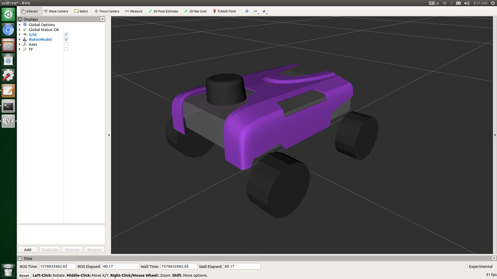
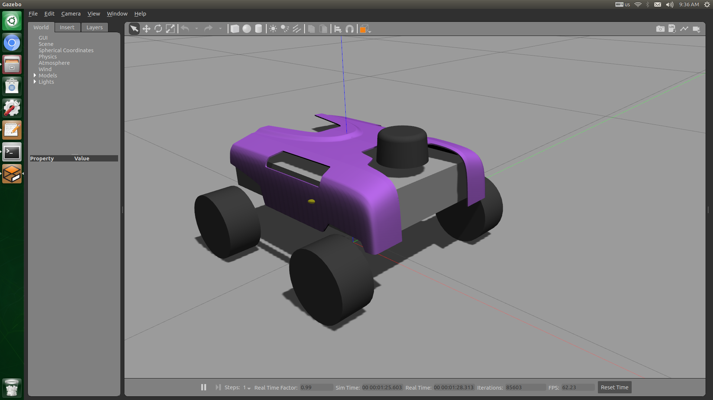
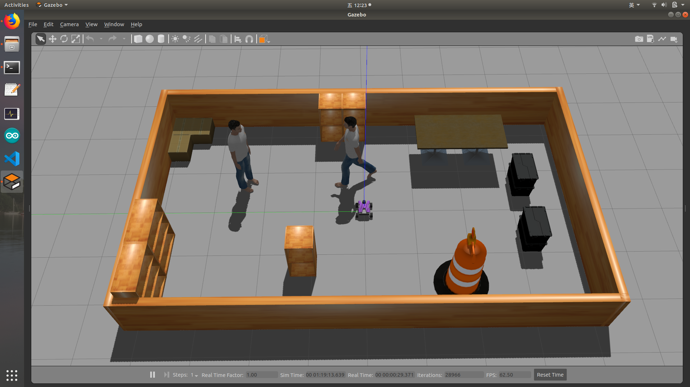
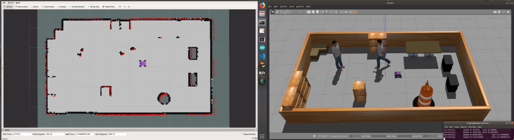
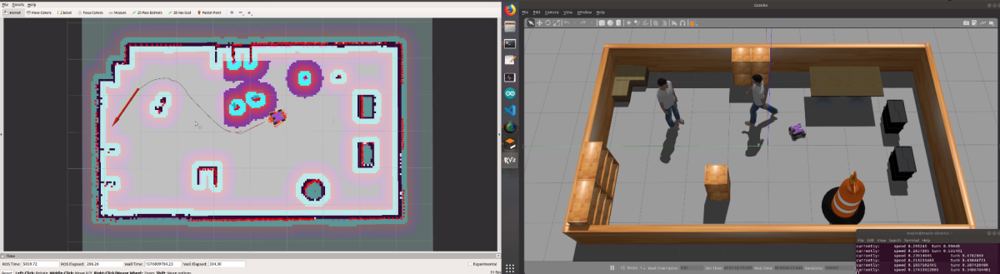

# Four Macnum Car   
## Four Macnum Wheel Car Description    
```bash
  roslaunch four_macnum_description display.launch
```    
    
    
## Four Macnum Wheel Car in Gazebo  
```bash
  roslaunch four_macnum_description gazebo.launch
```    
  
    
## Gazebo Simulation   
```bash
  roslaunch four_macnum_simulation four_macnum_simulation.launch
```
  
***错误解决***   
如果Gazebo软件一直无法打开，可能是因为电脑中缺少仿真世界里的各种模型文件，请复制"four_macnum_simulation/models"文件夹下所有模型到"~/.gazebo/models"下，重新运行launch文件即可。
   
## SLAM-Gmapping   
***在仿真内运行SLAM***  
```bash
  roslaunch four_macnum_simulation four_macnum_simulation.launch
  roslaunch four_macnum_slam four_macnum_slam.launch
  roslaunch four_macnum_bringup rviz.launch
  rosrun teleop_twist_keyboard teleop_twist_keyboard.py
```
使用键盘遥控器遥控小车在整个环境中往返移动，直至生成的地图完整、准确，保存地图到导航包路径下,详细操作参看下方视频。    
```bash
  cd **/four_macnum_navigation/maps
  rosrun map_server map_saver -f ./sim_map
```
***Or***   
***使用真实车运行SLAM***  
```bash
  roslaunch four_macnum_bringup four_macnum_robot.launch
  roslaunch four_macnum_slam four_macnum_slam.launch
  roslaunch four_macnum_bringup rviz.launch
  rosrun teleop_twist_keyboard teleop_twist_keyboard.py
```
注意此处地图文件名不同于上方
```bash
  cd **/four_macnum_navigation/maps
  rosrun map_server map_saver -f ./map
```
***错误解决***   
请确保电脑内装有以下几个Ros包：    
1. ros-melodic-gmapping   
2. ros-melodic-move-base    
3. ros-melodic-amcl   
4. ros-melodic-navigation   
   
SLAM-Gmapping视频🔗     
    
https://pan.baidu.com/play/video#/video?path=%2FROS%E8%A7%86%E9%A2%91%2F201912201025.mkv&t=-0    

## Navigation   
***在仿真内运行Navigation***  
```bash
  roslaunch four_macnum_simulation four_macnum_simulation.launch
  roslaunch four_macnum_navigation four_macnum_navigation.launch simulation:=true
  roslaunch four_macnum_bringup rviz.launch
  rosrun teleop_twist_keyboard teleop_twist_keyboard.py
```
首先在Rviz界面中使用"2D Pose Estimate"工具指定小车目前所在位置与方向，然后再使用键盘遥控器遥控小车原地旋转以使"小车附近的红色小箭头"聚拢在一起（即概率集中在一点处），停止小车转动。    
使用Rviz界面上的"2D Nav Goal"工具指定导航的目标位置与方向，等待小车移动到目标位置，中途可更改目标位置与方向，也可在其前进道路上临时增加障碍，观察效果，详细操作参看下方视频。   
***Or***   
***使用真实车运行Navigation***  
```bash
  roslaunch four_macnum_bringup four_macnum_robot.launch
  roslaunch four_macnum_navigation four_macnum_navigation.launch
  roslaunch four_macnum_bringup rviz.launch
  rosrun teleop_twist_keyboard teleop_twist_keyboard.py
```

导航Navigation视频🔗     
   
https://pan.baidu.com/play/video#/video?path=%2FROS%E8%A7%86%E9%A2%91%2F201912201038.mkv&t=-1    
